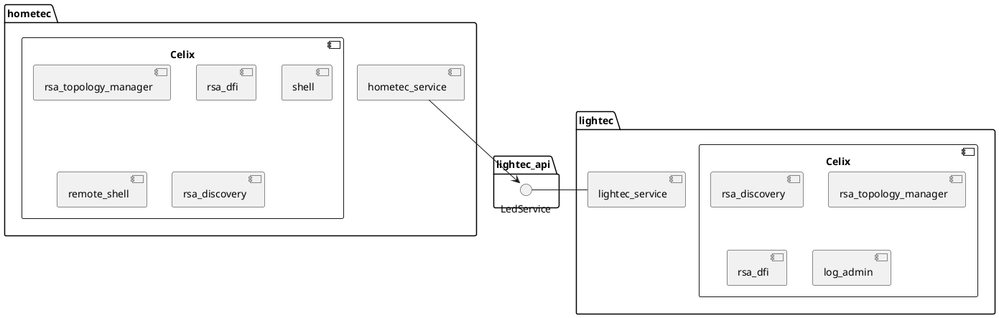

# Diagrama de Componente

```plantuml
@startuml
package hometec {
    [hometec_service]
    component Celix {
        [rsa_topology_manager]
        [rsa_dfi]
        [shell]
        [remote_shell]
        [rsa_discovery]
    }
}

package lightec_api {
    interface LedService
}

package lightec {
    LedService - [lightec_service]
    [hometec_service] --> LedService
    component Celix as remote_celix {
        [rsa_discovery] as remote_rsa_discovery
        [rsa_topology_manager] as remote_rsa_topology_manager
        [rsa_dfi] as remote_rsa_df
        [log_admin] as remote_log_admin
    }
}

@enduml
```
